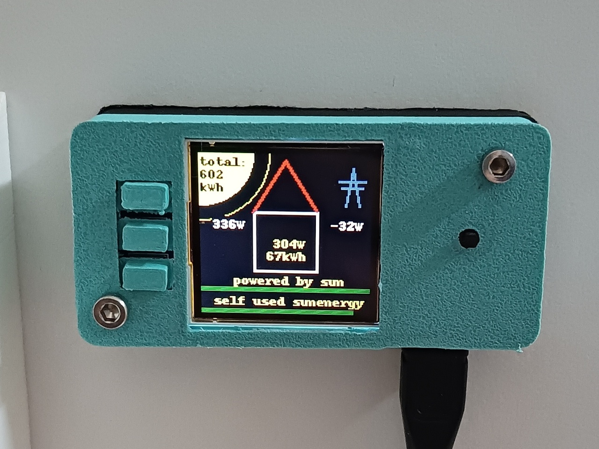
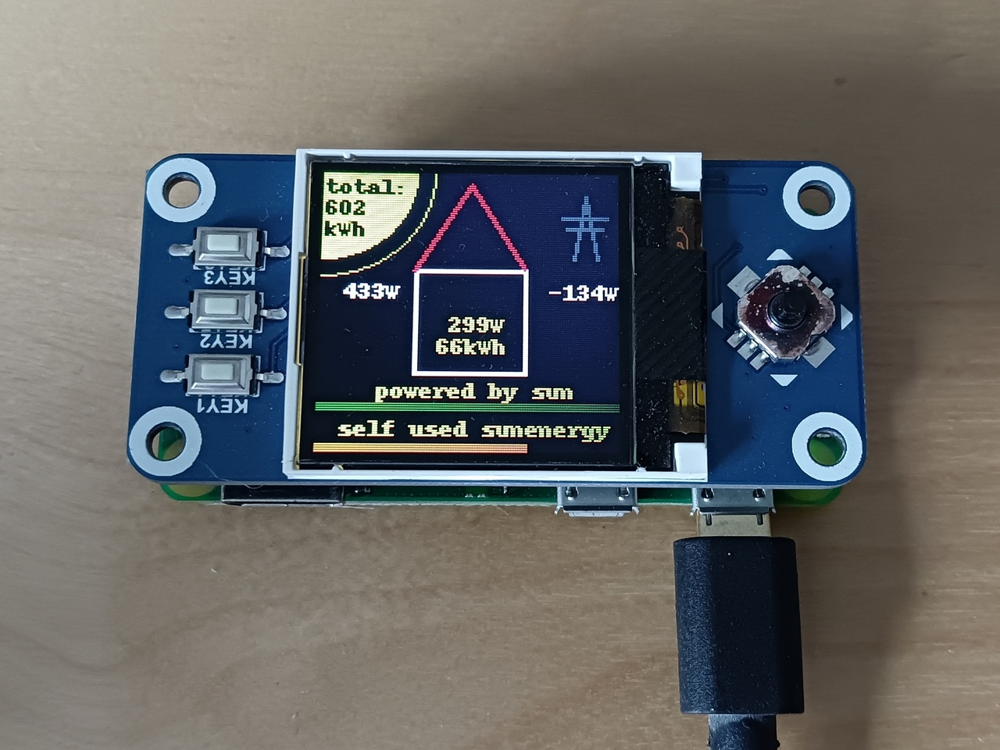
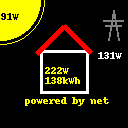
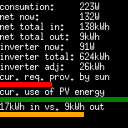

# RPi-household-energy-status #

I was looking for a way to measure the current energy consumption of my household and compare it with the photovoltaic system.
Basically, I'm not interested in long-term storage of the data, but rather in order to be able to spontaneously determine whether I'm currently purchasing energy from the grid or am already giving energy away to the grid operator.
My Environtment: Landis Gyr+ E220 smartmeter with Tasmota script: https://gist.github.com/enra64/0f34a2f233068f901a75c320f3b87cd0






You may get the case here: https://www.printables.com/de/model/258922

## Installation
install all needed packages to prepare the software environtent of your Raspberry Pi:

### enable SPI interface
```bash
sudo raspi-config
```

### install required components
```bash
sudo apt install python3-luma.lcd python3-psutil git -y
sudo git clone https://github.com/rm-hull/luma.examples /opt/luma.examples
sudo wget https://raw.githubusercontent.com/Starwhooper/luma.examples/patch-1/conf/st7735_128x128_WShat.conf -O /opt/luma.examples/conf/st7735_128x128_WShat.conf
```

### install this tool itself:
```bash
sudo git clone https://github.com/Starwhooper/RPi-household-energy-status /opt/RPi-household-energy-status
sudo chmod +x /opt/RPi-household-energy-status/comparedisplay.py
```

### config this tool:
```
sudo cp /opt/RPi-household-energy-status/config.json.example /opt/RPi-household-energy-status/config.json
sudo nano /opt/RPi-household-energy-status/config.json
```
* add credentials from solar inverter
* add ip adress from solar inverter an tasmota smartmeter

### add to autostart ###
add it to cronjob reboot
```bash
sudo crontab -e
```
insert line:
```
@reboot /opt/RPi-household-energy-status/comparedisplay.py --rotate 2 --config /opt/luma.examples/conf/st7735_128x128_WShat.conf
```

## Update
If you already use it, feel free to update with
```bash
cd /opt/RPi-household-energy-status
sudo git reset --hard #that should not be required, but its very often needed on my system
sudo git pull origin main
```

## Hardware
### Display
1.44" Waveshare
https://www.waveshare.com/wiki/1.44inch_LCD_HAT
### Case
STL Files: https://www.printables.com/de/model/258922-raspberry-pi-zero-with-waveschare-144-display-case
